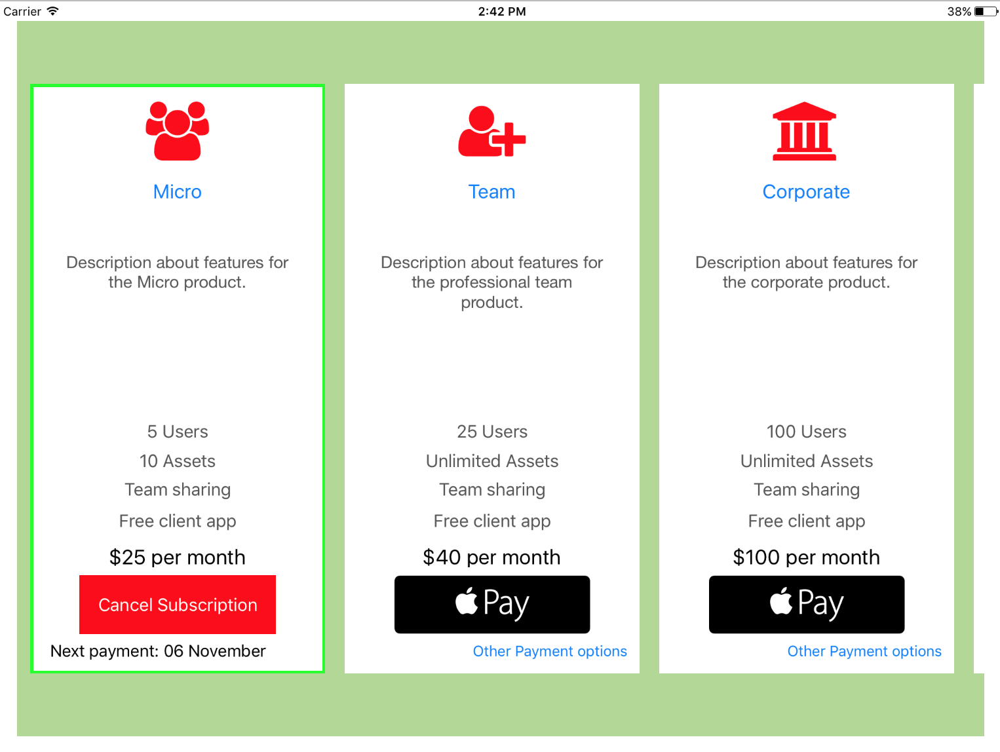
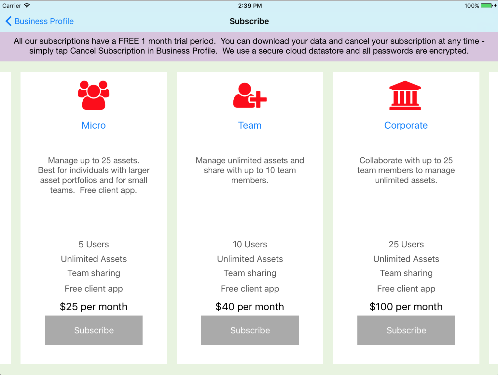

# BLAMPayment

##[](https://travis-ci.org/petetodd/BLAMPayment)
[](http://cocoapods.org/pods/BLAMPayment)
[](http://cocoapods.org/pods/BLAMPayment)
[](http://cocoapods.org/pods/BLAMPayment)

## Subscription management
Present users with a customised set of subscription options, highlight the current subscription and/or select a new subscription or cancel an existing subscription.  Present with either a single Subscribe button or Apple Pay and Other buttons.

Button taps trigger delegate protocols which send the details of the selected Subscription.

The included demo app provides a basic example.

### Default presentation

### Single button presentation


## Requirements
iOS9.3

## Installation
To run the example project, clone the repo, and run `pod install` from the Example directory.

BLAMPayment is available through [CocoaPods](http://cocoapods.org). To install
it, simply add the following line to your Podfile:

```ruby
pod "BLAMPayment"
```

## Author

Peter Todd, peter@petertodd.com

## License

BLAMPayment is available under the MIT license. See the LICENSE file for more info.
